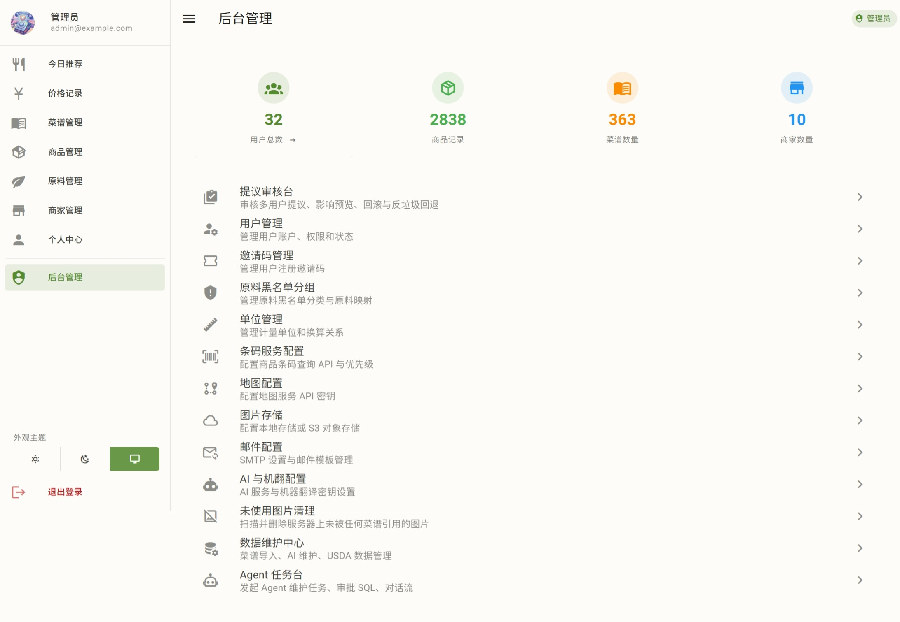
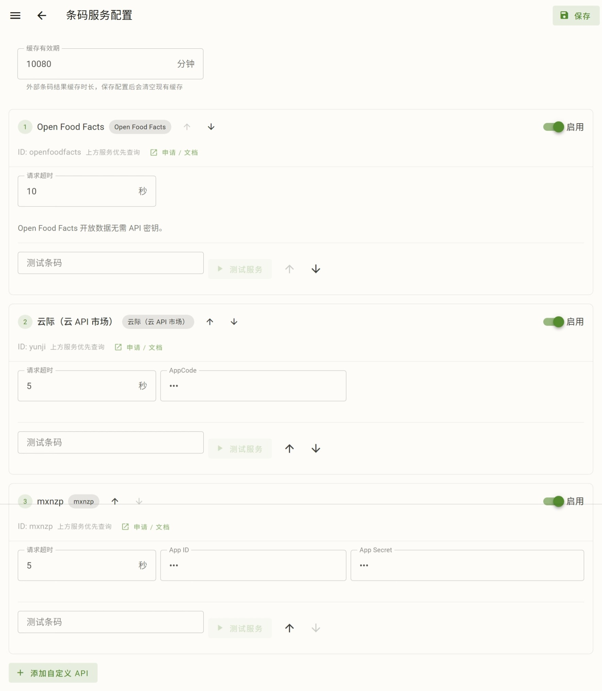

# 后台管理

管理员账号登录后进入后台首页，顶部是统计卡片（用户总数、商品记录、菜谱数量、商家数量；用户总数卡片可点击直达用户管理），下方是各管理功能的入口列表。

## 提议审核台

本页面审核普通用户修改系统数据的提议。详见 [提议审核台](review.md)。

## 用户管理

用户列表能看到所有用户（用户名、邮箱、角色、状态）。

### 新增与编辑用户

可改用户名、邮箱、角色（管理员/普通）、启用/禁用等。

在用户列表能够失效用户、设置用户为管理员，或者进行逆向操作。注意：

- 不能失效自己、取消自己的管理员权限
- 不能失效第一个账号、取消第一个账号的管理员权限

#### 重置密码

编辑表单旁有"**重置密码**"按钮，点开独立对话框，输两次新密码。

重置后该用户在**所有设备上的登录立即失效**（基于 `token_version` 机制：改密码时版本 +1，旧 token 全部作废）。

> 改密码作废 token 是安全设计——密码泄露后重置即可让盗号者掉线。

## 邀请码管理

该页面能够开关邀请码功能，以及管理邀请码。

“开启邀请码注册机制”开关控制注册是否需要邀请码。

邀请码列表能够查看邀请码及其使用情况、创建、过期时间。

创建、编辑邀请码时，可以定义最大使用次数、过期时间。留空表示不限次数 / 不过期。

创建邀请码时，如果邀请码文本留空，则随机生成邀请码。

## 原料黑名单分组

该页面能够维护 [原料黑名单](../profile.md#原料黑名单) 页面里面“快速选择”里面的分组。

系统默认按 **GB 7718 的 13 类过敏原**预设了过敏原分组（含麸质、甲壳纲、鱼类、花生、大豆、奶、坚果等），每个分组映射了一批原料。

点击页面右上角的按钮新增分组；点击分组右上角的编辑按钮编辑分组。新增、编辑仅限于名称、排序。

如果要新增分组里面的食材，则点击分组下方的“添加原料”添加。删除原料直接点击食材右边的叉号就行。

> 分组的删除、原料的变动，会同步影响使用对应分组的用户。

## 单位管理

可以维护单位及其换算关系。系统初始化时已经自动导入了一些单位。

尽管有这个页面，但是除非单位为某个度量衡制度下的单位，或者是有通用的、明确的换算关系，否则不建议在这里维护单位，而是为原料或商品维护自定义单位。

## 条码服务配置

可以维护条码服务，用于自动识别商品信息。

现支持以下服务：

- [Open Food Facts](https://world.openfoodfacts.org/)：免费无需注册，但服务器不稳定，且数据不足
- [mxnzp](https://www.mxnzp.com/doc/detail?id=6)：免费需注册，需要获取 App ID 和 App Secret
- [云际](https://market.aliyun.com/detail/cmapi031448)：通过阿里云云市场提供服务，需要购买服务后获取 AppCode

你也可以自己接入 API，配置好相应参数即可。

服务的优先级可以调整。

## 地图配置

生计兼容多种地图引擎（见 [商家与地图](../merchants-map.md#地图引擎)）。地图配置在这里统一管理：

- **启用的地图服务 / 地理编码服务**：勾选哪些引擎对用户可见、可用
- **各引擎 API 密钥**：高德 / 百度（GL）/ 腾讯 / 天地图 / OpenStreetMap 各填各的
- **默认引擎**：选一个作为系统默认
- **持久化**：配置存数据库，重启不丢

> 高德地图、百度地图、腾讯地图，填写相关密钥后，即可使用其官方 SDK；否则，系统使用其瓦片地图（模糊，且更新不及时）。天地图必须使用 API 密钥。
>
> 改完保存即生效，用户刷新页面就用新配置。地图引擎的坐标系差异由系统内部统一处理，配置时只管填密钥。

## 图片存储

系统可以通过两种方式存储菜谱、头像等图片：

- 本地存储：放在 `backend/static/images` 目录下
- S3：支持 S3 兼容的对象存储平台

数据库初始化时，能够在 `backend/.env` 里面配置图片存储的参数，以便初始化数据库时，写入菜谱图片。但是也可以在之后切换。切换后，相关配置写入数据库，在有数据库里面的配置时，不会看 `backend/.env` 里面的配置。

页面上会显示出目前使用的存储后端。两个存储后端可以随意切换。

### 切换存储后端

点击该按钮之后会启动向导。

1. 先选择存储后端是本地存储还是 S3。

  

2. 如果选择了 S3，填写相关配置信息：

  

3. 如果选择了 S3，接下来需要测试连接：

  

4. 开始迁移图片。如果你自己迁移，可以选择跳过。

  

  迁移时，会增量迁移（跳过路径相同的文件）。迁移过程中可以中止。

  

5. 最后确认切换。点击后才会改变配置。

  

## 邮件配置

本页面配置邮件的 SMTP 配置，以及各个邮件模板的格式。

邮件模板目前主要是为了提议发起、审核的发送邮件。其中可以使用以下占位符：

- `${proposal_id}`：提议 ID
- `${entity_type_label}`：提议里的实体类型
- `${action_label}`：提议的动作
- `${entity_label}`：提议的目标
- `${proposer_name}`：提议的用户
- `${review_note}`：审核意见

## AI 与机翻配置

本页面配置系统里面用到 AI Agent 的地方、使用机器翻译平台的地方的 API 等配置。

- **AI provider**：Claude Code / Codex / OpenAI 兼容 API / Anthropic 兼容 API（三个面板）
- **机翻 provider**：百度 / 阿里云 / DeepL（三个面板）
- 每个 provider 一张卡片，填 API 密钥等，统一保存。可以测试，以确认配置是否正确。

> 如果使用 Claude Code 或 Codex，则会试图在环境变量的 PATH 中寻找其可执行文件，配置使用你默认给它的配置。请自行配置。Docker 版本并未封装 Claude Code 与 Codex，请自行安装、配置。

## 未使用图片清理

本页面可以寻找并清理系统里面没有使用，但是存储里面有的图片。会根据图片未被使用的时长，分组显示，并显示它们占的空间。

> 图片未被使用的时长，是从它不再被任何地方引用的时间点开始算起。菜谱图片修改、菜谱删除、头像更换等均有可能导致图片不再被使用。系统启动时，也会扫描一遍图片，确保引用情况正确。

你可以点击选择图片，或者是选择整个组的图片，然后删除。

## 数据维护中心

本页面可以预备一些功能所需的数据：

- **菜谱数据**。如果未配置初始化时导入，则可以通过页面上“从 Git 仓库导入”、“从本地路径导入”或“上传压缩包导入”的功能，导入这些数据。
- **USDA 数据，及其食材名、营养素的翻译**。用于营养成分的匹配。在“USDA 数据管理”里面，可以下载 USDA 数据；也可以上传其 zip 包。翻译需要通过“AI 后处理”功能，通过“食材名翻译”“营养素翻译”，配置好翻译后端，使用 AI 或机翻来翻译。
- **原料的自定义单位、密度的推测**。在 “AI 后处理”功能中，通过“自定义单位校准”“推测密度”功能，配置好 AI 推断后端，自动给系统里面的原料填入这些数据。

这些任务能够在任务列表里面查看进度、中断。如果是 AI Agent 任务，点击可以到 Agent 任务台的对应任务里面查看输出。

详见 [数据维护中心](data-maintenance.md)。

## Agent 任务台

本页面能够查看 AI Agent 任务的执行输出。详见 [Agent 任务台](agent.md)。
