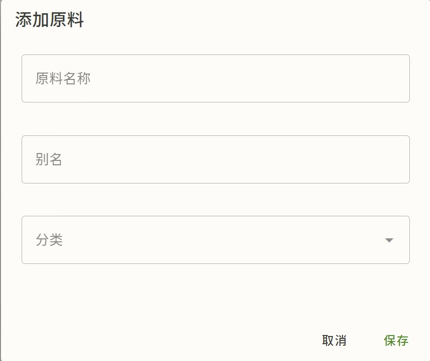
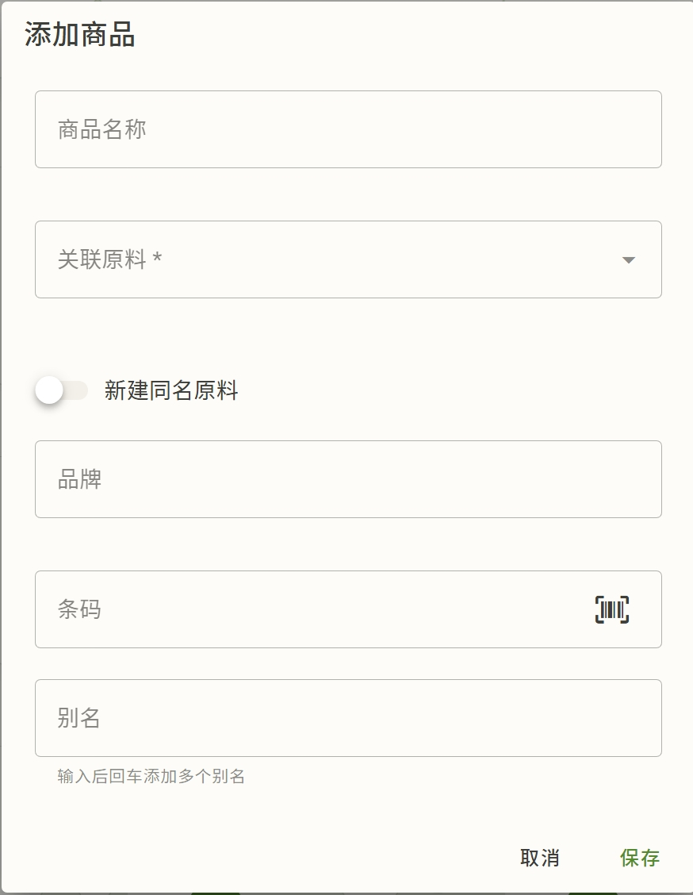

# 原料与商品

原料和商品是生计基础库的两大主角。这篇讲怎么管它们、改它们（含普通用户和管理员的差异）。

> 先搞清它俩的关系：[核心概念 · 实体模型](concepts.md#a-实体模型系统怎么理解吃)。

## 新增原料与商品

先新增原料，再新增商品。

创建商品时，如果管理员设置了条码查询服务，则可通过扫描条码，快速填充信息。

## 原料详情页

进任一原料的详情页，能看到：

- **基本信息**：名称、分类、别名
- **层级关系**：父/子（包含关系）、可替代（互为回退源）
- **营养**：各营养素、NRV%
- **价格**：最新加权价、综合价、价格趋势、各商家价格
- **关联商品**：挂在它下面的所有商品，含每个商品的权重

## 商品详情页

进任一商品：

- **基本信息**：名称、挂靠的原料、条码、标签
- **别名**：用于粘贴导入等场景的模糊匹配
- **价格记录**：增删改（你的私有数据，直接生效）
- **价格趋势**
- **商品权重**：见下

## 商品加权价格

一个原料常有多个商品（不同品牌/规格，价差大）。系统按**权重**把它们的价加权成原料价：

- **全局权重**：管理员设，对所有用户生效
- **我的覆盖**：你设，优先于全局。如果不开启“覆盖全局权重”，则用全局

权重 0–100（默认 50）。**权重只影响"平均"**，最高/最低/计数不受影响。详见 [核心概念 · 价格体系](concepts.md#c-价格体系)。

> 原料详情页和商品详情页都能编辑权重（滑块 + 开关）。普通用户只能设自己的覆盖；全局权重只有管理员能改。

## 改/删原料与商品（审核差异）

原料、商品都是**共享数据**，改动按角色分流：

| 角色 | 改/删 | 生效方式 |
|---|---|---|
| 普通用户 | 提交后进入**审核队列** | 管理员审核通过后生效；提交时返回"待审核"提示，不立即生效 |
| 管理员 | 直接写库 | 立即生效，留"管理员直写"痕 |

详情见 [提议审核台](admin/review.md)。

删除相关：

- 删除都是**软删除**（标记无效，可恢复/回滚）
- **删原料**会级联：它的商品、价格记录一起软删
- **删商品**会级联：它的价格记录软删
- 系统会检查**唯一性/引用**：比如某原料只有一个商品时，删商品可能让该原料无价；某原料被菜谱引用时也会提示

> 审核台能回滚：如果管理员误删，可以在审核记录里反级联恢复。

## 商品拆分为原料

某个商品想独立出来单独管理（比如它有自己的营养、自己的价格历史），可以"**拆分为原料**"：把它从当前原料里分出来，成为一个同名原料，原商品的属性/营养随之迁移。

## 原料合并

把当前原料合并到另一个原料。合并后，当前原料的菜谱引用、商品关联将迁移到目标原料。

## 商品合并

可以将商品合并到相同原料下另一个商品。执行后：

- 价格记录将迁移到目标商品
- 营养信息将丢弃
- 当前商品将被删除

## 原料层级与可替代

原料之间的父/子、可替代关系也属于共享数据，建立/修改走提议-审核。这些关系影响价格和营养的回退链（见 [核心概念 · 原料之间的关系](concepts.md#b-原料之间的关系)）。
